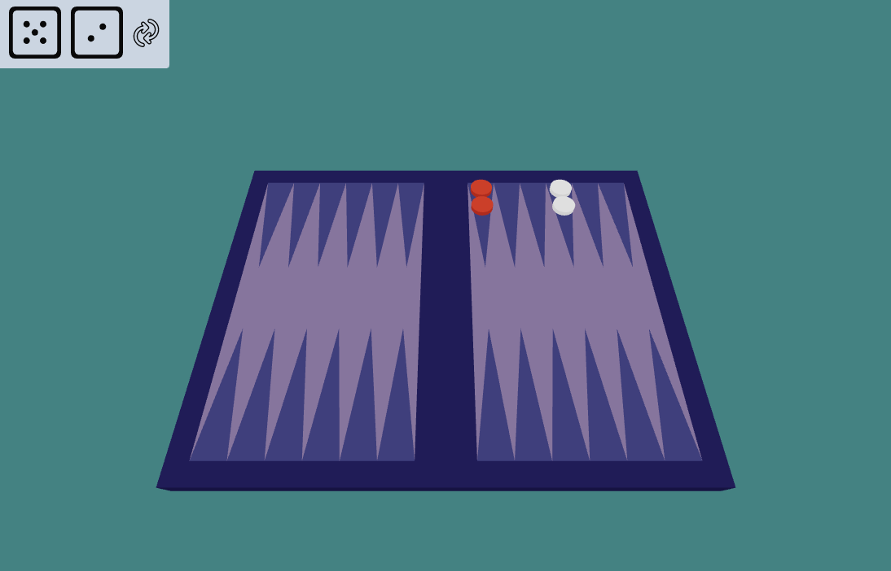

# Backgammon game

This is a 3D web implementation of 16th century irish board game. Backgammon is a two-player game of contrary movement in which each player has fifteen pieces.These pieces move along twenty-four 'points' according to the roll of two dice. The objective of the game is to move the fifteen pieces around the board and be first to bear off, i.e., remove them from the board. The achievement of this while the opponent is still a long way behind results in a triple win known as a backgammon, hence the name of the game.

## Table of contents

- [Features](#features)
- [Preview](#preview)
- [Technology](#Technology)
- [Contributing](#contributing)
- [License](#license)

## Preview

## Technology

Project is created with:

- Three.js
- WebGL
- JavaScript
- MongoDB
- Node.js
- Socket.io

# License

[MIT](https://choosealicense.com/licenses/mit/)
